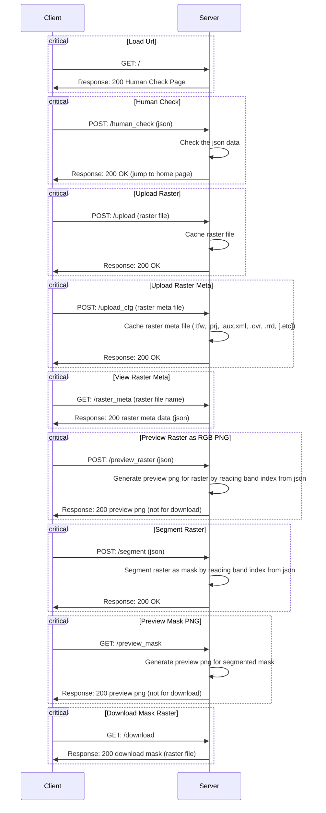

# Developer Documentation
## Introduction
This is a localhost-based web application for image segmentation.

## Work Principles
The front-end is developed by `html5` + `css3` + `javascript`, 
and the back-end is developed by `Python` with third-party libraries.
When the back-end server is running, the front-end can send `GET` and `POST` requests to the server.



## Back-end
### Setup
The back-end server is developed by `Python` with third-party libraries.

Clone the repository first.

Use conda to import the environment:
```bash
conda env create -f environment.yml
```
And activate the environment:
```bash
conda activate seg_any
```
Then install the package:
```bash
pip install git+https://github.com/facebookresearch/segment-anything.git
pip install -r requirements.txt
```

After that, you should download the model from [ViT-H SAM model](https://dl.fbaipublicfiles.com/segment_anything/sam_vit_h_4b8939.pth)
and put it in `ckpt` folder.

### Run
These are the help information:
```terminal
Usage: python ultimate.py [OPTIONS]
Options:
  (no option)              run the server on ipv4 address and port 5000
  --host-port=HOST:PORT    specify the host and port to run the server
  --help                   show this help message and exit
```
Run the server:
```bash
python ultimate.py
```

## Front-end

### Interact with the server
The server can handle `GET` and `POST` requests.
It is recommended to use `JavaScript` to interact with the server.

### GET
- `/` : get the home page;
- `/preview_mask` : get the preview mask png;
- `/raster_meta` : get the raster metadata as json;
- `/download` : download the segmented mask raster file;

### POST
- `/` : get the home page;
- `/human_check` : check the human check code:
    - _arguments_ should be a json with keys:
        * `uuid`: string, the uuid generated by the server to identify the client, which is stored in the cookie;
        * `answer`: string or number, the answer of the human check question;
    - _return_:
        * if the answer is correct, jump to the home page;
        * if the answer is wrong, refresh the human check page;
- `/upload` : upload the raster file;
    - _arguments_ should be a file with key `file`;
    - _return_:
        * if the file is uploaded successfully, return 200;
- `/upload_cfg` : upload the raster config file;
    - _arguments_ should be a file with key `file`;
    - _return_:
        * if the file is uploaded successfully, return 200;
- `/preview_raster` : get the preview raster png:
    - _arguments_ should be a json with keys:
        * `r`: int, the index of the red band;
        * `g`: int, the index of the green band;
        * `b`: int, the index of the blue band;
    - _return_:
        * return the preview raster png;
- `/segment` : segment the raster file:
    - _arguments_ should be a json with keys:
        * `out_raster` : name of the output raster file (GeoTiff), in the cache folder, must end with `.tif`;
        * `rgb_index`: index of the RGB bands (begin from 1) in the source raster file, json array like `[3, 2, 1]`;
        * `points_per_side` : number of points per side of the square (integer);
        * `points_per_batch` : number of points per batch (integer);
        * `pred_iou_thresh` : threshold of the predicted IoU (float)
        * `stability_score_thresh` : threshold of the stability score (float);
        * `stability_score_offset` : offset of the stability score (float);
        * `box_nms_thresh` : threshold of the box NMS (float);
        * `crop_n_layers` : number of layers of the crop (integer);
        * `crop_nms_thresh` : threshold of the crop NMS (float);
        * `crop_overlap_ratio` : overlap ratio of the crop (float);
        * `crop_n_points_downscale_factor` : downscale factor of the crop (integer);
        * `min_mask_region_area` : minimum area of the mask region (integer);
    - _return_:
        * if the file is segmented successfully, return 200;


### Develop
Please using `html5` + `css3` + `javascript` to develop the front-end.
- there must be a `index.html` file in `templates` folder, as the home page.
- for `*.html` files except `index.html`, please put them in `static` folder.
- for `*.css`, `*.js` or other static resource files, please put them in `static` folder.
- when you want to use resources in `static` folder, please use `{{url_for('static', filename='xxx')}}` to get the url.
- it can do `GET` and `POST` requests to the server.
- please delete the example files in `static`.
- please modify the html code in `templates/index.html` to make it more beautiful and useful.