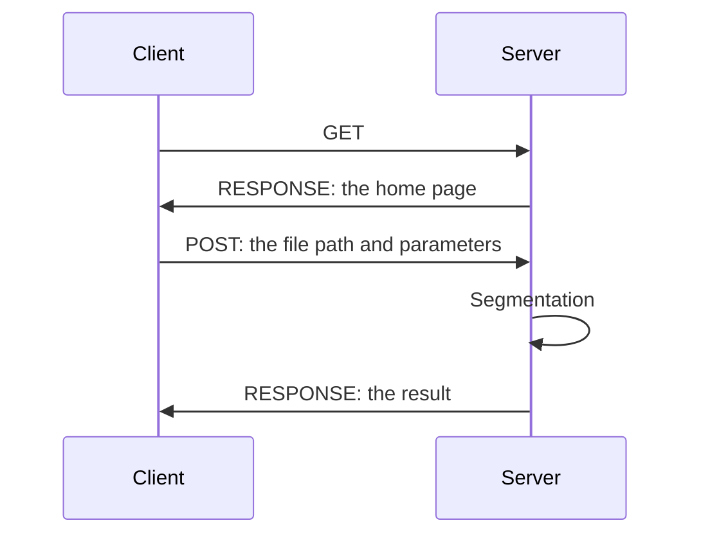

# Developer Documentation
## Introduction
This is a localhost-based web application for image segmentation.

## Work Principles
The front-end is developed by `html5` + `css3` + `javascript`, and the back-end is developed by `Python` with third-party libraries.
When the application is running, it will open a localhost server, and the front-end will send requests to the server.
If the front-end sends a `GET` request, the server will open the home page.
If the front-end sends a `POST` request, the server will segment the image and return the result.
Because the application is localhost-based, it is unnecessary to transfer the file between the logical client and server,
path of the file is enough.



## Back-end
### Setup
The back-end server is developed by `Python` with third-party libraries.

Clone the repository first.

Use conda to import the environment:
```bash
conda env create -f environment.yml
```
And activate the environment:
```bash
conda activate seg_any
```
Then install the package:
```bash
pip install git+https://github.com/facebookresearch/segment-anything.git
pip install -r requirements.txt
```

After that, you should download the model from [ViT-H SAM model](https://dl.fbaipublicfiles.com/segment_anything/sam_vit_h_4b8939.pth)
and put it in `ckpt` folder.

### Run
Run the server:
```bash
python main.py
```

## Front-end

### Interact with the server
The server can handle `GET` and `POST` requests.
It is recommended to use `JavaScript` to interact with the server.

#### GET
##### Get https://localhost:xxxxx/
While a `GET` request is sent to the server, the server will open the home page.

#### POST

##### Post to https://localhost:xxxxx/
While a `POST` request is sent to the server, the server will segment the image and return the result.
The data should be stringified `JSON` format or can be parsed as python `dict` object, encoded in `UTF-8`.
These are the essential keys in the `JSON` object:
- `src_raster`: the source image path, string.
- `out_raster`: the output image path, string, must be a `GeoTIFF` file.
- `rgb_index`: the index of the RGB band, list of int which begins from 1, length 3, like `[3, 2, 1]`, means `R=band3, G=band2, B=band1`.
- `points_per_side`: The number of points to be sampled along one side of the image. The total number of points is points_per_side**2. If None, 'point_grids' must provide explicit point sampling.
- `points_per_batch`: Sets the number of points run simultaneously
            by the model. Higher numbers may be faster but use more GPU memory.
          pred_iou_thresh (float): A filtering threshold in [0,1], using the
            model's predicted mask quality, int.
- `stability_score_thresh`: A filtering threshold in [0,1], using
            the stability of the mask under changes to the cutoff used to binarize
            the model's mask predictions, float.
- `stability_score_offset`: The amount to shift the cutoff when
            calculated the stability score, float.
- `box_nms_thresh`: The box IoU cutoff used by non-maximal
            suppression to filter duplicate masks, float.
- `crop_n_layers`: If >0, mask prediction will be run again on
            crops of the image. Sets the number of layers to run, where each
            layer has 2**i_layer number of image crops, int.
- `crop_nms_thresh`: The box IoU cutoff used by non-maximal
            suppression to filter duplicate masks between different crops.
- `crop_overlap_ratio`: Sets the degree to which crops overlap.
            In the first crop layer, crops will overlap by this fraction of
            the image length. Later layers with more crops scale down this overlap, float.
- `crop_n_points_downscale_factor`: The number of points-per-side
            sampled in layer n is scaled down by crop_n_points_downscale_factor**n, int.
- `min_mask_region_area`: If >0, postprocessing will be applied
            to remove disconnected regions and holes in masks with area smaller
            than min_mask_region_area. Requires opencv. int.

For example:
```bash
curl -H  "Content-Type: application/json" -X POST -d "{'src_raster': 'E:/Coding/python/seg-any/example/dataset/src/hunnu_1m.tif', 'out_raster': 'E:/Coding/python/seg-any/example/dataset/export/hunnu_1x1m.tif', 'rgb_index': [3, 2, 1], 'points_per_side': 64, 'points_per_batch': 64, 'pred_iou_thresh': 0.88, 'stability_score_thresh': 0.95, 'stability_score_offset': 1.0, 'box_nms_thresh': 0.7, 'crop_n_layers': 0, 'crop_nms_thresh': 0.7, 'crop_overlap_ratio': 512 / 1500, 'crop_n_points_downscale_factor': 1, 'min_mask_region_area': 100}" "http://localhost:64194/"
```

##### Post to https://localhost:xxxxx/raster_meta
While a `POST` request is sent to the server, the server will return the meta data of the raster as `JSON` format.

Example:
```python
import requests
import pathlib

raster_path = pathlib.Path(__file__).parent.absolute() / 'dataset' / 'src' / 'hunnu.tif'
res = requests.post('http://localhost:26694/raster_meta', data=str(raster_path.absolute()))
print(res.content.decode('utf-8'))
```
Terminal output:
```plaintext
D:\anaconda3\envs\seg_any\python.exe E:\Coding\python\seg-any\example\test_meta.py 
{"width": 1207, "height": 1237, "X resolution": 1.0, "Y resolution": -1.0, "band_count": 3, "band_meta": [{"description": "", "min": 0.0, "max": 255.0, "nodata": -1.0, "scale": null, "offset": null}, {"description": "", "min": 0.0, "max": 255.0, "nodata": -1.0, "scale": null, "offset": null}, {"description": "", "min": 0.0, "max": 255.0, "nodata": -1.0, "scale": null, "offset": null}]}

Process finished with exit code 0
```

### Develop
Please using `html5` + `css3` + `javascript` to develop the front-end.
- there must be a `index.html` file in `templates` folder, as the home page.
- for `*.html` files except `index.html`, please put them in `static` folder.
- for `*.css`, `*.js` or other static resource files, please put them in `static` folder.
- when you want to use resources in `static` folder, please use `{{url_for('static', filename='xxx')}}` to get the url.
- it can do `GET` and `POST` requests to the server.
- please delete the example files in `static`.
- please modify the html code in `templates/index.html` to make it more beautiful and useful.