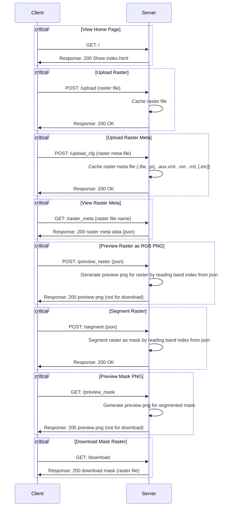

# Developer Documentation
## Introduction
This is a localhost-based web application for image segmentation.

## Work Principles
The front-end is developed by `html5` + `css3` + `javascript`, 
and the back-end is developed by `Python` with third-party libraries.
When the back-end server is running, the front-end can send `GET` and `POST` requests to the server.



## Back-end
### Setup
The back-end server is developed by `Python` with third-party libraries.

Clone the repository first.

Use conda to import the environment:
```bash
conda env create -f environment.yml
```
And activate the environment:
```bash
conda activate seg_any
```
Then install the package:
```bash
pip install git+https://github.com/facebookresearch/segment-anything.git
pip install -r requirements.txt
```

After that, you should download the model from [ViT-H SAM model](https://dl.fbaipublicfiles.com/segment_anything/sam_vit_h_4b8939.pth)
and put it in `ckpt` folder.

### Run
Run the server:
```bash
python main.py
```

## Front-end

### Interact with the server
The server can handle `GET` and `POST` requests.
It is recommended to use `JavaScript` to interact with the server.

### GET
- `localhost:[port]/` : get the home page;
- `localhost:[port]/preview_mask` : get the preview mask png;
- `localhost:[port]//raster_meta` : get the raster metadata as json;
- `localhost:[port]/download` : download the segmented mask raster file.

### POST
- `localhost:[port]/upload` : upload the raster file;
- `localhost:[port]/upload_cfg` : upload the raster config file;
- `localhost:[port]/preview_raster` : get the preview raster png;
- `localhost:[port]/segment` : segment the raster file.

### Example
```python
import requests
import json

port = 5000      # TODO: change the port number for your server

# test GET / -> home page
r0 = requests.get('http://localhost:{}/'.format(port))
print(r0.text)

# test POST /upload
ras_pth = 'path/to/raster/file.tif'
r1 = requests.post('http://localhost:{}/upload'.format(port), files={'file': open(ras_pth, 'rb')})
print(r1.status_code)

# test POST /upload_cfg
cfg_pth = 'path/to/raster/file.tfw'
r2 = requests.post('http://localhost:{}/upload_cfg'.format(port), files={'file': open(cfg_pth, 'rb')})
print(r2.status_code)

# test GET /raster_meta
r3 = requests.get('http://localhost:{}/raster_meta'.format(port))
print(r3.content)

# test POST /preview_raster
r4 = requests.post('http://localhost:{}/preview_raster'.format(port), json={"r": 3, "g": 2, "b": 1})
print(r4.status_code)

# test POST /segment
data_dict = {
    "out_raster": "out.tif",
    "rgb_index": [3, 2, 1],
    "points_per_side": 64,
    "points_per_batch": 64,
    "pred_iou_thresh": 0.88,
    "stability_score_thresh": 0.95,
    "stability_score_offset": 1.0,
    "box_nms_thresh": 0.7,
    "crop_n_layers": 0,
    "crop_nms_thresh": 0.7,
    "crop_overlap_ratio": 512 / 1500,
    "crop_n_points_downscale_factor": 1,
    "min_mask_region_area": 100
}
r5 = requests.post('http://localhost:{}/segment'.format(port), json=data_dict)
print(r5.status_code)

# test GET /preview_mask
r6 = requests.get('http://localhost:{}/preview_mask'.format(port))
print(r6.status_code)

# test GET /download
r7 = requests.get('http://localhost:{}/download'.format(port))
with open('out.tif', 'wb') as f:
    f.write(r7.content)
```


### Develop
Please using `html5` + `css3` + `javascript` to develop the front-end.
- there must be a `index.html` file in `templates` folder, as the home page.
- for `*.html` files except `index.html`, please put them in `static` folder.
- for `*.css`, `*.js` or other static resource files, please put them in `static` folder.
- when you want to use resources in `static` folder, please use `{{url_for('static', filename='xxx')}}` to get the url.
- it can do `GET` and `POST` requests to the server.
- please delete the example files in `static`.
- please modify the html code in `templates/index.html` to make it more beautiful and useful.