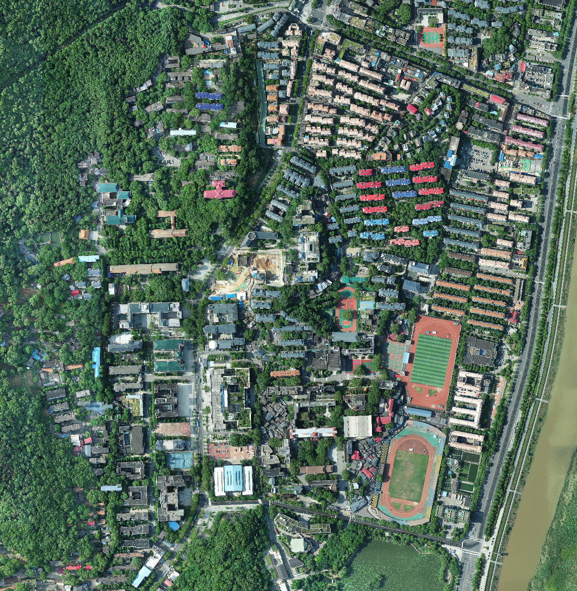
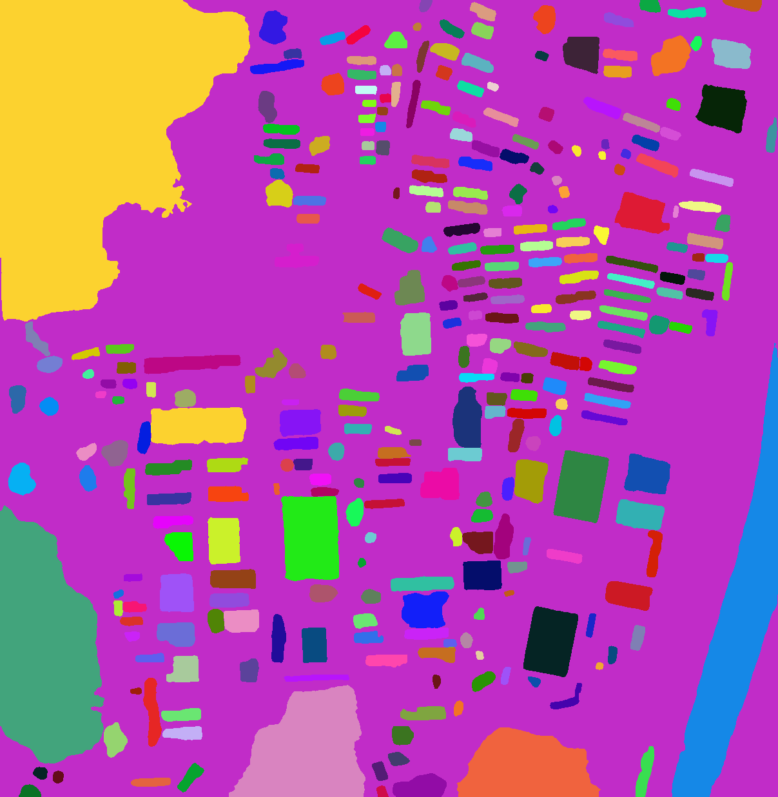
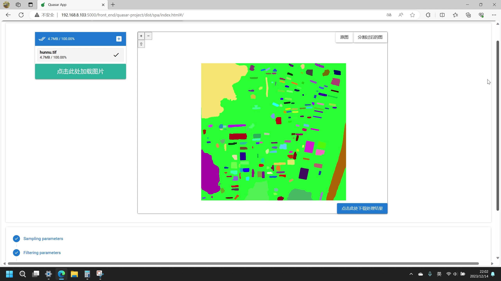
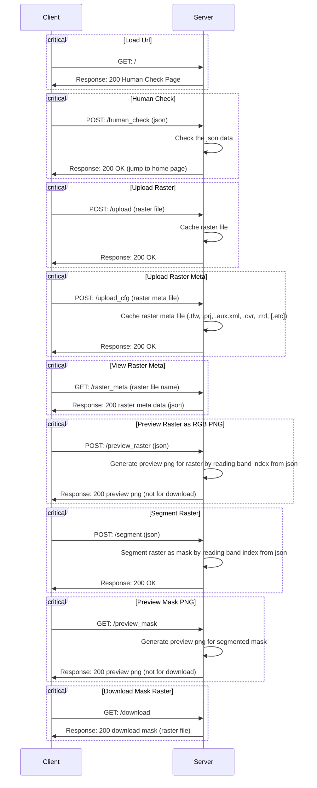

# Segment Anything in Remote Sensing Image

## Main Developers

### Back-end: 

- [李昌哲 202130163019](https://github.com/Jaffe2718)

### Front-end:

- [sirasuazusa](https://github.com/sirasuazusa)
- [Curry Young](https://github.com/Xizhe03)

## Introduction

This is a server-side application that uses the Meta's large model named [Segment Anything](https://segment-anything.com/), originally used for general image segmentation, to perform segmentation processing on remote sensing images.
For the server application operators, they should set up this application on their server host machine, and run the application in the background to servers on public IPs or LAN IPs.
For the common users, they only need to open the URL of the server application in their browser, and then they can upload remote sensing images and configuration files to the server, and then they can view the metadata of the remote sensing images, preview the remote sensing images, segment the remote sensing images, preview the segmentation results, and download the segmentation results.


<div style="text-align: center;">Figure 1. The remote sensing image of Hunan Normal University (example dataset)</div>


<div style="text-align: center;">Figure 2. The segmentation result of the remote sensing image of Hunan Normal University (example dataset)</div>


<div style="text-align: center;">Figure 3. The UI of the client</div>

## Dependencies

| Name    | Version | Description                                                        |
|:--------|:--------|:-------------------------------------------------------------------|
| Python  | 3.11.x  | Anaconda is recommended                                            |
| git     | xx.xx.x | Version control                                                    |
| Node.js | 18.x.x  | Front-end development                                              |
| misc    |         | see `requirements.txt` and `front_end/quasar-project/package.json` |

## Installation

### Clone the repository

```bash
git clone https://github.com/Jaffe2718/seg-any-remote-sensing.git
```

### Set up the back-end conda environment

```bash
conda env create -f environment.yaml
conda activate seg_any
```

### Install the back-end package

```bash
pip install git+https://github.com/facebookresearch/segment-anything.git
pip install -r requirements.txt
```

### Setup the front-end node environment

```bash
cd front_end/quasar-project
npm install
```

### Build the front-end

```bash
cd front_end/quasar-project
quasar build
```

### Download the pre-trained model

Download [ViT-H SAM model](https://dl.fbaipublicfiles.com/segment_anything/sam_vit_h_4b8939.pth) and put it in the `ckpt` folder.

## Usage

### For server application operators
1. Run the server application on your server host machine
```bash
python ultimate.py
```

2. Configuration (optional)
- You can modify the configuration file `configuration.json` to set the server's hostname, port, whether to enable debug mode, whether to enable multi-threading mode, IP access frequency limit, etc.
  There are the following configuration items:
> - "host": **String**, the hostname of the server, default is "auto", means the ipv4 address of the server host machine.<br>
> - "port": **Integer**, the port of the server, default is 5000.<br>
> - "debug": **Boolean**, whether to enable debug mode, default is false.
> - "multi_thread": **Boolean**, whether to enable multi-threading mode, default is true.
> - "ip_access_limit": **JsonArray**, the IP access frequency limit, each item is a **String**, here are some examples:
> > "ip_access_limit": ["10/minute", "100/hour", "1000/day"]<br>

### For common users

- Just open the URL of the server application in your browser, and then you can upload remote sensing images and configuration files to the server, and then you can view the metadata of the remote sensing images, preview the remote sensing images, segment the remote sensing images, preview the segmentation results, and download the segmentation results.

## Work Principle

### Description

The backend of this project primarily uses Python for development, involving the following key technologies and libraries:

1. **Flask**: This is a lightweight Web service framework used to handle client GET and POST requests.

2. **Flask-Limiter**: This library is used to limit the access frequency of clients to prevent DDOS attacks.

3. Python built-in libraries: Such as os, socket, uuid, json, etc., used for file operations, network operations, generating unique identifiers, handling json data, etc.

4. **Pillow**: This is an image processing library used for handling image data.

5. **Segment Anything**: This is an image segmentation library used for segmenting images.

6. **GDAL**: This is a library used for handling raster data.

The front-end of this project primarily uses Vue3 and Quasar for development, involving the following key technologies and libraries:

1. **Vue3**: This is a JavaScript framework used to develop front-end applications.

2. **Quasar**: This is a Vue3-based UI framework used to develop front-end applications.

3. **OpenLayers**: This is a JavaScript library used to display raster data.

The main flow of the project is as follows:

1. After the server starts, it first loads the configuration file `configuration.json`, setting the server's hostname, port, whether to enable debug mode, whether to enable multi-threading mode, IP access frequency limit, etc.

2. The server uses the Flask framework, defining multiple routes and corresponding processing functions, such as `/`, `/human_check`, `/upload`, `/upload_cfg`, `/raster_meta`, `/preview_raster`, `/segment`, `/preview_mask`, `/download`, etc.

3. When a new client connects to the server, the server assigns it a UUID and performs a human check. If the client passes the human check, the server marks it as human and reduces its response delay. If the client does not pass the human check, the server increases its response delay to prevent DDOS attacks.

4. Clients can upload remote sensing image files and configuration files to the server, and the server will save these files in the cache folder.

5. Clients can request to view the metadata of the remote sensing image file, and the server will return a json object containing the metadata.

6. Clients can request to preview the remote sensing image file, and the server will generate a preview image and return it.

7. Clients can request to segment the remote sensing image file, and the server will use the Segment Anything library to segment the remote sensing image and save the segmentation results in the cache folder.

8. Clients can request to preview the segmentation results, and the server will generate a preview mask image and return it.

9. Clients can request to download the segmentation results, and the server will return a GeoTiff file containing the segmentation results.

10. The server also starts two cleanup threads, one for cleaning up the cache folder and the other for cleaning up expired client information.

### Workflow



### Segment Parameters Description
```plaintext
Using a SAM model, generates masks for the entire image.
        Generates a grid of point prompts over the image, then filters
        low quality and duplicate masks. The default settings are chosen
        for SAM with a ViT-H backbone.

        Arguments:
          src_raster: source raster path.
          out_raster: output raster path (must be *.tif).
          rgb_index: [r, g, b] index of bands, int in tuple, start from 1.
          points_per_side (int or None): The number of points to be sampled
            along one side of the image. The total number of points is
            points_per_side**2. If None, 'point_grids' must provide explicit
            point sampling.
          points_per_batch (int): Sets the number of points run simultaneously
            by the model. Higher numbers may be faster but use more GPU memory.
          pred_iou_thresh (float): A filtering threshold in [0,1], using the
            model's predicted mask quality.
          stability_score_thresh (float): A filtering threshold in [0,1], using
            the stability of the mask under changes to the cutoff used to binarize
            the model's mask predictions.
          stability_score_offset (float): The amount to shift the cutoff when
            calculated the stability score.
          box_nms_thresh (float): The box IoU cutoff used by non-maximal
            suppression to filter duplicate masks.
          crop_n_layers (int): If >0, mask prediction will be run again on
            crops of the image. Sets the number of layers to run, where each
            layer has 2**i_layer number of image crops.
          crop_nms_thresh (float): The box IoU cutoff used by non-maximal
            suppression to filter duplicate masks between different crops.
          crop_overlap_ratio (float): Sets the degree to which crops overlap.
            In the first crop layer, crops will overlap by this fraction of
            the image length. Later layers with more crops scale down this overlap.
          crop_n_points_downscale_factor (int): The number of points-per-side
            sampled in layer n is scaled down by crop_n_points_downscale_factor**n.
          min_mask_region_area (int): If >0, postprocessing will be applied
            to remove disconnected regions and holes in masks with area smaller
            than min_mask_region_area. Requires opencv.
```

## Development

see [DEV.md](DEV.md)

## Open Source License
[Apache License 2.0](LICENSE)

## Reference

[1] Kirillov, A., Mintun, E., Ravi, N., Mao, H., Rolland, C., Gustafson, L., Xiao, T., Whitehead, S., Berg, A. C., Lo, W.-Y., Dollár, P., & Girshick, R. (2023). Segment Anything. ArXiv:2304.02643.